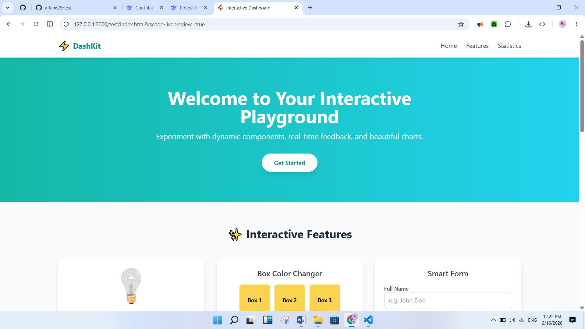

# 📊 DashKit – Interactive Dashboard

> **A modern, responsive, and interactive single‑page dashboard built with Tailwind CSS and vanilla JavaScript. 🚀 Perfect for learning, prototyping, or as a starting point for your next web project.**

[](https://opensource.org/licenses/MIT)
[](https://github.com/affan675/test/releases)
[](https://github.com/affan675/test/actions)
[](https://github.com/affan675/test/stargazers)
[](https://github.com/affan675/test/network/members)
[](https://github.com/affan675/test/issues)
[](https://github.com/affan675/test/pulls)
[](https://github.com/affan675/test/commits/main)
[](https://github.com/affan675/test)
[](https://github.com/affan675/test)

---

## 🗺️ Table of Contents

- [Project Overview](#project-overview)
- [Features](#features)
- [Screenshots](#screenshots)
- [Demo](#demo)
- [Tech Stack](#tech-stack)
- [Architecture](#architecture)
- [Installation](#installation)
- [Environment Variables](#environment-variables)
- [Usage](#usage)
- [API Documentation](#api-documentation)
- [Performance](#performance)
- [Security](#security)
- [Testing](#testing)
- [Deployment](#deployment)
- [Roadmap](#roadmap)
- [Contributing](#contributing)
- [Code Style](#code-style)
- [Documentation](#documentation)
- [Changelog](#changelog)
- [FAQ](#faq)
- [Troubleshooting](#troubleshooting)
- [License](#license)
- [Author](#author)
- [Acknowledgements](#acknowledgements)
- [Support](#support)
- [Project Statistics](#project-statistics)
- [Final Footer](#final-footer)

---

## 🎯 Project Overview

**DashKit** is a lightweight, interactive dashboard built with **Tailwind CSS** and **vanilla JavaScript**. It provides a set of reusable UI components – a lightbulb toggle, a color changer, and a smart form with validation – all wrapped in a beautiful, responsive layout.

**💡 Why it exists:**  
Many developers need a quick, visually appealing starting point for prototyping or learning front‑end concepts. DashKit offers a clean codebase with modern design patterns, making it easy to understand, extend, and customise.

**🛠️ What problem it solves:**  
- Accelerates the setup of a professional‑looking dashboard.
- Demonstrates best practices for modular JavaScript and Tailwind utility‑first styling.
- Provides ready‑to‑use interactive components without heavy frameworks.

**👥 Target users:**  
- **Developers** who want a foundation for their own projects.
- **Students** learning HTML, CSS, and JavaScript.
- **Designers** seeking a UI kit they can adapt.

**🌟 Key value proposition:**  
- **Zero build tools** – just open `index.html` in your browser.
- **Fully responsive** – works on all screen sizes.
- **Accessible** – semantic HTML and ARIA-friendly attributes.
- **Modular code** – easy to maintain and extend.

---

## 🚀 Features

### 💎 Core Features
- **💡 Lightbulb Toggle** – Click the bulb or the On/Off buttons to switch it on and off.
- **🎨 Box Color Changer** – Change the colour of the first box with a single click.
- **📝 Smart Form** – Validates name (min 2 chars), phone (11 digits), and age (positive integer).
- **📱 Responsive Design** – Adapts seamlessly from mobile to desktop.
- **✨ Modern UI** – Gradient hero, shadows, rounded corners, and hover animations.

<details>
<summary><b>🔍 View Advanced & Planned Features</b></summary>

#### ⚙️ Advanced Features
- **🧩 Modular JavaScript** – Components are separated into individual modules for maintainability.
- **⚡ Utility‑first CSS** – Tailwind CDN enables rapid styling without extra build steps.
- **💬 Interactive Feedback** – Form messages appear with colour‑coded success/error states.
- **🌊 Smooth Interactions** – Transitions and hover effects enhance user experience.

#### 🔮 Future‑Ready Features
- **🌙 Dark mode** (planned) – toggle between light and dark themes.
- **📈 Chart integration** – replace the placeholder with a dynamic chart library.
- **🌐 Real‑time data** – connect to an API for live updates.
</details>

---

## 🖼️ Screenshots



*The main dashboard showing the hero section, feature cards, and chart area.*

---

## 🔗 Demo

- **Live Demo:** https://affan675.github.io/test/  
- **📺 Video Demo:** *(Coming soon)*

---

## 🛠️ Tech Stack

| Category | Technology |
|----------|------------|
| **Frontend** | HTML5, CSS3 (Tailwind CSS via CDN), Vanilla JavaScript |
| **Backend** | None (static site) |
| **Database** | None |
| **APIs** | None (self‑contained) |
| **Authentication** | Not applicable |
| **DevOps** | GitHub Pages for hosting |
| **Hosting** | GitHub Pages |
| **Testing** | Manual (planned: Jest) |
| **Tools** | VS Code, Git, GitHub |

---

## 🏗️ Architecture

### 📐 High‑Level Overview
DashKit is a single‑page application (SPA) that consists of:

- **HTML** – semantic structure with sections and interactive elements.
- **Tailwind CSS** – utility classes for rapid styling (loaded via CDN).
- **Vanilla JavaScript** – modular scripts that handle DOM manipulation and validation.

The JavaScript is organised into components (lightbulb, color changer, form) and utility functions (validators). This separation makes the code easy to navigate and extend.

### 📂 Folder Structure


```text
project-root/
├── index.html               # Main page
├── src/
│   ├── assets/
│   │   └── img/
│   │       ├── pic_bulboff.gif
│   │       └── pic_bulbon.gif
│   ├── js/
│   │   ├── main.js          # Entry point
│   │   ├── components/
│   │   │   ├── lightbulb.js
│   │   │   ├── colorChanger.js
│   │   │   └── formHandler.js
│   │   └── utils/
│   │       └── helpers.js
│   └── home.PNG             # Screenshot for README
├── README.md
└── LICENSE
```

### Component Breakdown
- **Lightbulb** – Toggles the image source and provides click/button events.
- **Color Changer** – Listens to button clicks and updates the background color of a single box.
- **Form** – Validates inputs and displays feedback messages.

---

## Installation

### Prerequisites
- A modern web browser (Chrome, Firefox, Edge, Safari).
- (Optional) A local server for development (e.g., VS Code Live Server, Python `http.server`).

### Clone the Repository
```bash
git clone https://github.com/affan675/test.git
cd test
```

### No Dependencies to Install
Since DashKit uses Tailwind via CDN and vanilla JavaScript, **no package manager is required**. Simply open `index.html` in your browser.

### Running Locally
- **Double‑click** `index.html` – works directly in most browsers.
- **For best experience** (especially with ES modules), use a local server:
  - VS Code: install **Live Server** extension and right‑click → Open with Live Server.
  - Python: `python -m http.server 8000` then open `http://localhost:8000`.

---

## Environment Variables

No environment variables are required for this static project.

---

## Usage

### Example Workflow
1. Open the dashboard in your browser.
2. **Lightbulb:** Click the bulb image or the On/Off buttons to toggle the light.
3. **Color Changer:** Click any colour button (Red, Blue, Green, Reset) to update the first box.
4. **Smart Form:** Fill in the fields and submit – validation will check:
   - Name ≥ 2 characters
   - Phone = exactly 11 digits
   - Age = positive integer ≤ 150
5. A success or error message appears below the form.

### Typical Use Cases
- **Prototyping** – quickly set up a UI with interactive components.
- **Learning** – study how to organise vanilla JS with ES modules and Tailwind.
- **Boilerplate** – fork and customise for your own projects.

---

## API Documentation

*This project is entirely client‑side and does not provide a public API. However, the JavaScript exports can be used as building blocks for other frontend projects.*

---

## Performance

- **No build tools** – zero compilation overhead.
- **Tailwind CDN** – loads the full CSS library; for production, consider using a custom build to reduce size.
- **Minimal JavaScript** – only essential logic, no heavy libraries.
- **Responsive images** – the lightbulb GIFs are lightweight.

### Scalability
For larger projects, you can split the components further, adopt a state management pattern, and implement lazy loading. The current structure is designed for clarity and ease of extension.

---

## Security

- **Client‑side validation** – improves user experience but should be paired with server‑side validation in a full application.
- **No external requests** – reduces attack surface.
- **Content Security Policy (CSP)** – not enforced, but you can add one if deploying to production.

---

## Testing

Currently, testing is manual. In future, we plan to add:

- **Unit tests** for validation functions (Jest).
- **Integration tests** for component interactions.
- **End‑to‑end tests** (Cypress or Playwright).

To run tests (once implemented):
```bash
npm test
```

---

## Deployment

### Development (Local)
Use any local server (Live Server, Python HTTP server) to preview changes.

### Staging
Deploy to a staging branch on GitHub Pages or Netlify for team review.

### Production (GitHub Pages)
1. Push your code to the `main` branch.
2. In your repository settings, enable GitHub Pages for the `main` branch.
3. Your site will be live at `https://affan675.github.io/test/`.

---

## Roadmap

### Current Version (v1.0.0)
- [x] Core interactive components
- [x] Responsive design
- [x] Modular JavaScript
- [x] Basic form validation

### Upcoming Features (v1.1.0)
- [ ] Dark mode toggle
- [ ] Replace static chart with Chart.js
- [ ] Add more boxes to colour changer
- [ ] Improve form with real‑time validation

---

## Contributing

We welcome contributions! Please follow the guidelines in CONTRIBUTING.md.

---

## License

This project is licensed under the **MIT License** – see the LICENSE file for details.

---

## Author

**Affan Adil**  
- GitHub: affan675  
- Portfolio: affan675.github.io/01_portfolio_v2  
- Email: affanadil119@gmail.com

**Acknowledgement**  
This project is based on the original work by **Pooria Dev** – the creator of the initial `test` repository. We thank Pooria for the foundation that made this dashboard possible.

---

## Final Footer

**Maintained by** – Affan Adil  
**Made with ❤️** – Open‑source software for the community.  

> **"Build what matters, share what you learn."**